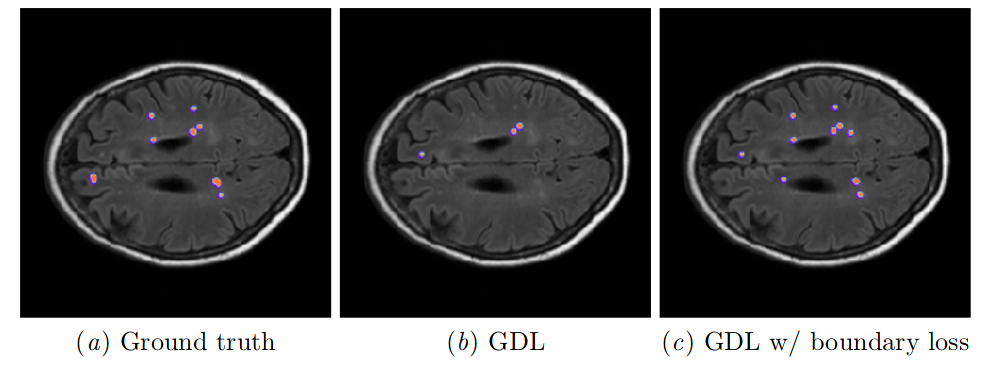
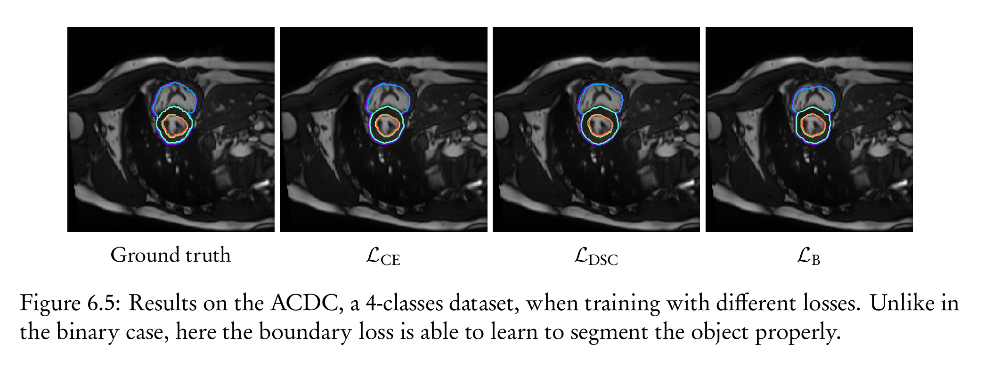

# Boundary loss
Official repository for [Boundary loss for highly unbalanced segmentation](http://proceedings.mlr.press/v102/kervadec19a.html), _runner-up for best paper award_ at [MIDL 2019](https://2019.midl.io). Recording of the talk is available [on the MIDL YouTube channel](https://www.youtube.com/watch?v=_z6gmFlD_qE).

A journal extension has been published in [Medical Image Analysis (MedIA), volume 67](https://doi.org/10.1016/j.media.2020.101851).

* [MIDL 2019 Proceedings](http://proceedings.mlr.press/v102/kervadec19a.html)
* [MedIA volume](https://doi.org/10.1016/j.media.2020.101851)
* [arXiv preprint](https://arxiv.org/abs/1812.07032)



The code has been simplified and updated to the latest Python and Pytorch release. On top of the original ISLES and WMH datasets, we also include a working example in a multi-class setting (ACDC dataset), *where the boundary loss can work as a stand-alone loss*.

## Table of contents
* [Table of contents](#table-of-contents)
* [Requirements (PyTorch)](#requirements-pytorch)
* [Other frameworks](#other-frameworks)
    * [Keras/tensorflow](#kerastensorflow)
    * [Others](#others)
* [Usage](#usage)
* [Extension to 3D](#extension-to-3d)
* [Automation](#automation)
    * [Data scheme](#data-scheme)
        * [dataset](#dataset)
        * [results](#results)
    * [Cool tricks](#cool-tricks)
* [Multi-class setting](#multi-class-setting)
* [Frequently asked questions](#frequently-asked-question)
    * [Can the loss be negative?](#can-the-loss-be-negative)
    * [Do I need to normalize the distance map?](#do-i-need-to-normalize-the-distance-map)
* [Other papers using boundary loss](#other-papers-using-boundary-loss)


## Requirements (PyTorch)
Core implementation (to integrate the boundary loss into your own code):
* python3.5+
* pytorch 1.0+
* scipy (any version)

To reproduce our experiments:
* python3.9+
* Pytorch 1.7+
* nibabel (only when slicing 3D volumes)
* Scipy
* NumPy
* Matplotlib
* Scikit-image
* zsh

## Other frameworks
### Keras/Tensorflow
@akamojo and @marcinkaczor proposed a Keras/Tensorflow implementation (I am very grateful for that), available in [keras_loss.py](keras_loss.py).
The discussion is available in the [related github issue](https://github.com/LIVIAETS/surface-loss/issues/14).

### Others
People willing to contribute other implementations can create a new pull-request, for their favorite framework.

## Usage
The boundary loss, at its core, is a pixel-wise multiplication between the network predictions (the _softmaxes_), and a pre-computed distance map. Henceforth, a big chunk of the implementation happens at the data-loader level.

The implementation has three key functions:
* the boundary loss itself (`BoundaryLoss` in [losses.py#L76](losses.py#L76));
* the distance map function (`one_hot2dist` in [utils.py#L260](utils.py#L260));
* the dataloader transforms (`dist_map_transform` in [dataloader.py#L105](dataloader.py#L105)).

This codebase computes the distance map at the dataloader level, taking as an input the label file (stored as a `.png`), putting it through the `dist_map_transform`, and then returning it with the corresponding input image. A higher-order view of the process:
```python
class SliceSet(Dataset):
    def __init__(self):
        self.filenames: list[str]  # You get the list as you would usually
        self.dataset_root: Path  # Path to the root of the data

        self.disttransform = dist_map_transform([1, 1], 2)

    def __get__(self, n: int) -> dict[str, Tensor]:
        filename: str = self.filenames[index]

        image = Image.open(self.dataset_root / "img" / filename)
        label = Image.open(self.dataset_root / "gt" / filename)

        image_tensor: Tensor  # usual transform for an image
        one_hot_tensor: Tensor  # Usualy transform from png to one_hot encoding
        dist_map_tensor: Tensor = self.disttransform(label)

        return {"images": image_tensor,
                "gt": one_hot_tensor,
                "dist_map": dist_map_tensor}
```

In the main loop (when iterating over the dataloader), this gives the following pseudo-code:
```python
dice_loss = GeneralizedDiceLoss(idc=[0, 1])  # add here the extra params for the losses
boundary_loss = BoundaryLoss(idc=[1])

α = 0.01
for data in loader:
    image: Tensor = data["images"]
    target: Tensor = data["gt"]
    dist_map_label: list[Tensor] = data["distmap"]

    pred_logits: Tensor = net(image)
    pred_probs: Tensor = F.softmax(pred_logits, dim=1)

    gdl_loss = dice_loss(pred_probs, target)
    bl_loss = boundary_loss(pred_probs, dist_map_label)  # Notice we do not give the same input to that loss
    total_loss = gdl_loss + α * bl_loss

    loss.backward()
    optimizer.step()
```

Special care has to be taken when the spatial resolution varies across axises; this is especially true in 3D. There is an optional argument in the `one_hot2dist` function, and the `dist_map_transform` is parametrized with the resolution and number of classes. For instance:
```python
disttransform = dist_map_transform([1, 1], 2)
```
will instantiate a distance transform for a binary setting, with 1mm on each axis, while
```python
disttransform = dist_map_transform([0.97, 1, 2.5], 5)
```
would be for a 5-classes setting, with the `z` axis much wider than `x` or `y`.

When dealing with a distance map in 3D, it is easiest to compute it while slicing the 3D volume to 2D images. An example of such processing is done in [preprocess/slice_wmh.py#L94](preprocess/slice_wmh.py#L94)).

## Extension to 3D
Extension to a 3D-CNN is trivial, one need only to pre-compute the 3D-distance map, and to sub-patch it in a traditionnal fashion.

The code of the Boundary loss remains the same, except for the einsum (line #89) that accounts for the extra axis (`xyz` in place of `wh`):
```python
        multipled = einsum("bkxyz,bkxyz->bkxyz", pc, dc)
```

## Automation
Experiments are handled by [GNU Make](https://en.wikipedia.org/wiki/Make_(software)). It should be installed on pretty much any machine.

Instruction to download the data are contained in the lineage files [ISLES.lineage](data/ISLES.lineage) and [wmh.lineage](data/wmh.lineage). They are text files containing the md5sum of the original zip.

Once the zip is in place, everything should be automatic:
```sh
make -f isles.make
make -f wmh.make
```
Usually takes a little bit more than a day per makefile.

This perform in the following order:
* unpacking of the data;
* remove unwanted big files;
* normalization and slicing of the data;
* training with the different methods;
* plotting of the metrics curves;
* display of a report;
* archiving of the results in an .tar.gz stored in the `archives` folder.

Make will handle by itself the dependencies between the different parts. For instance, once the data has been pre-processed, it won't do it another time, even if you delete the training results. It is also a good way to avoid overwriting existing results by accident.

Of course, parts can be launched separately :
```sh
make -f isles.make data/isles # Unpack only
make -f isles.make data/ISLES # unpack if needed, then slice the data
make -f isles.make results/isles/gdl # train only with the GDL. Create the data if needed
make -f isles.make results/isles/val_dice.png # Create only this plot. Do the trainings if needed
```
There is many options for the main script, because I use the same code-base for other projects. You can safely ignore most of them, and the different recipe in the makefiles should give you an idea on how to modify the training settings and create new targets. In case of questions, feel free to contact me.

### Data scheme
#### datasets
For instance
```
ISLES/
    train/
        cbf/
            case_10_0_0.png
            ...
        cbv/
        gt/
        in_npy/
            case_10_0_0.npy
            ...
        gt_npy/
        ...
    val/
        cbf/
            case_10_0_0.png
            ...
        cbv/
        gt/
        in_npy/
            case_10_0_0.npy
            ...
        gt_npy/
        ...
```
The network takes npy files as an input (there is multiple modalities), but images for each modality are saved for convenience. The gt folder contains gray-scale images of the ground-truth, where the gray-scale level are the number of the class (namely, 0 and 1). This is because I often use my [segmentation viewer](https://github.com/HKervadec/segmentation_viewer) to visualize the results, so that does not really matter. If you want to see it directly in an image viewer, you can either use the remap script, or use imagemagick:
```
mogrify -normalize data/ISLES/val/gt/*.png
```

#### results
```
results/
    isles/
        gdl/
            best_epoch/
                val/
                    case_10_0_0.png
                    ...
            iter000/
                val/
            ...
            best.pkl # best model saved
            metrics.csv # metrics over time, csv
            best_epoch.txt # number of the best epoch
            val_dice.npy # log of all the metric over time for each image and class
        gdl_surface_steal/
            ...
        val_dice.png # Plot over time comparing different methods
        ...
    wmh/
        ...
archives/
    $(REPO)-$(DATE)-$(HASH)-$(HOSTNAME)-isles.tar.gz
    $(REPO)-$(DATE)-$(HASH)-$(HOSTNAME)-wmh.tar.gz
```

### Cool tricks
Remove all assertions from the code. Usually done after making sure it does not crash for one complete epoch:
```sh
make -f isles.make <anything really> CFLAGS=-O
```

Use a specific python executable:
```sh
make -f isles.make <super target> CC=/path/to/the/executable
```

Train for only 5 epochs, with a dummy network, and only 10 images per data loader. Useful for debugging:
```sh
make -f isles.make <really> NET=Dimwit EPC=5 DEBUG=--debug
```

Rebuild everything even if already exist:
```sh
make -f isles.make <a> -B
```

Only print the commands that will be run:
```sh
make -f isles.make <a> -n
```

Create a gif for the predictions over time of a specific patient:
```
cd results/isles/gdl
convert iter*/val/case_14_0_0.png case_14_0_0.gif
mogrify -normalize case_14_0_0.gif
```

## Multi-class setting
The implementation for multi-class is trivial and requires no modification: one only requires to change the parameters `idc` of the boundary loss to supervise all classes. In the case of ACDC (4-classes), we have:
```python
boundary_loss = BoundaryLoss(idc=[0, 1, 2, 3])
```



## Frequently asked question
### Can the loss be negative?
Yes. As the distance map is signed (meaning that inside the object, the distance is negative), a perfect prediction will sum only negative distances, leading to a negative value. As we are in a minimization setting, this is not an issue.

### Do I need to normalize the distance map?
Possibly, it will be dataset dependent. In our experiments, we did not had to, but several persons reported that normalization helped in their respective application.

## Other papers using boundary loss
If your paper uses the boundary loss, and you want to be added, feel free to drop us a message.

* How Distance Transform Maps Boost Segmentation CNNs: An Empirical Study, MIDL 2020, [Conference link](https://2020.midl.io/papers/ma20a.html), [code](https://github.com/JunMa11/SegWithDistMap)
* Multi-modal U-Nets with Boundary Loss and Pre-training for Brain Tumor Segmentation, MICCAI Brainlesion Workshop 2020, [proceedings](https://link.springer.com/chapter/10.1007/978-3-030-46643-5_13)
* Deep learning approach to left ventricular non-compactionmeasurement, pre-print 2020, [arXiv](https://arxiv.org/abs/2011.14773)
* Esophageal Tumor Segmentation in CT Imagesusing Dilated Dense Attention Unet (DDAUnet), pre-print 2020, [arXiv](https://arxiv.org/abs/2012.03242), [code](https://github.com/yousefis/DenseUnet_Esophagus_Segmentation)
* Vehicle lane markings segmentation and keypoint determination using deep convolutional neural networks, Multimedia Tools and Applications (2021), [journal link](https://link.springer.com/article/10.1007/s11042-020-10248-2)
* A global method to identify trees outside of closed-canopy forests with medium-resolution satellite imagery, International journal of remote sensing 2021, [DOI](https://doi.org/10.1080/01431161.2020.1841324), [code](https://github.com/wri/restoration-mapper)